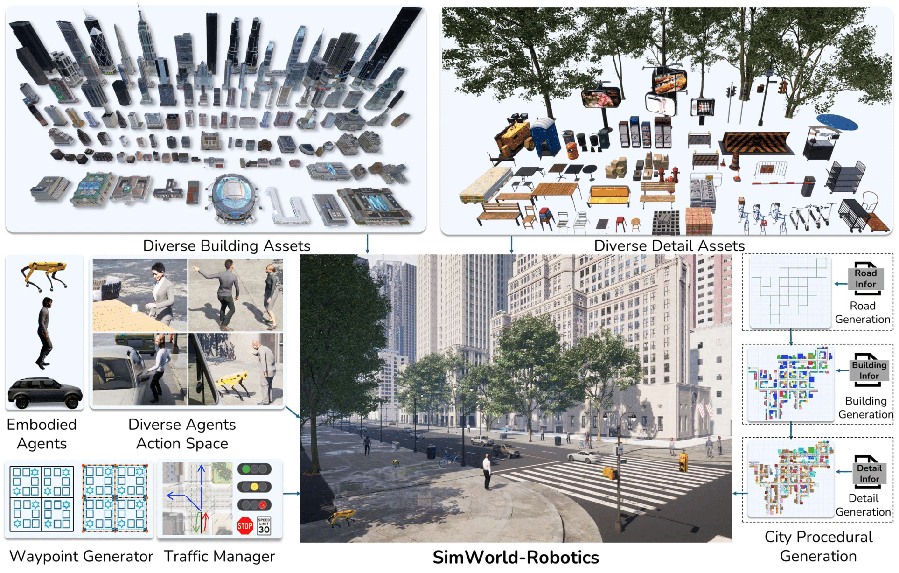

# SimWorld-Robotics: Synthesizing Photorealistic and Dynamic Urban Environments for Multimodal Robot Navigation and Collaboration
<p align="center">
  
</p>

**SimWorld-Robotics** is an extension of [SimWorld](https://github.com/SimWorld-AI/SimWorld) that introduces key features for embodied robotics research. These additions include procedural city generation, a traffic system, and support for a new embodied agent: the quadruped robot.

<!-- <div align="center">
    <a href="https://simworld-ai.github.io/"></a>
</div> -->

## 🔥 News
 - 2025.10 The first formal release of **SimWorld-Robotics** has been published! 🚀
 - 2025.9 **SimWorld-Robotics** has been accepted to NeurIPS 2025 main track! 🎉


## 💡 Introduction
This repo serves as a benchmark platform for the SimWorld-MMNav and SimWorld-MRS in **SimWorld-Robotics**:

1.  A standardized OpenAI gym interface for connecting and evaluating various baselines.
2.  Procedural scene and task generation for creating diverse and scalable simulation environments and tasks.
3.  The SimWorld-20k dataset is available via this [link](https://huggingface.co/datasets/jise/simworld-20k).


### Project Structure
```bash
SimWorld-Robotics/
├── baseline/                     # Baselines for SimWorld-MMNav and SimWorld-MRS
│   ├── requirements.txt          # Baseline dependencies
│   ├── single/                   # Single-agent navigation baselines
│   ├── multi/                    # Multi-agent collaboration baselines
│   ├── finetune/                 # Fine-tuning scripts
│   └── vla/                      # Vision-Language-Action models
├── simworld_gym/                 # Core gym environment package
│   ├── config/                   # Configuration files for assets and robots
│   ├── envs/                     # Gym environments
│   │   ├── simple_world.py       # Single-agent navigation environment
│   │   ├── traffic_world.py      # Single-agent with traffic
│   │   ├── world_buffer.py       # Multi-agent environment
│   │   └── setting/              # Task data (extracted from test_data)
│   │       ├── single_agent_world/  # Single-agent tasks
│   │       └── multi_agent_world/   # Multi-agent tasks
│   ├── task_generator/           # Procedural task generation
│   └── utils/                    # Utility functions
├── sample_baseline.ipynb         # Quick start notebook for single-agent navigation
├── video_record.ipynb            # Video recording utility
└── readme.md                     # Me
```

## 🚀 Setup

### Installation

1. **Clone the repository**
```bash
git clone git@github.com:SCAI-JHU/SimWorld-Robotics.git
cd SimWorld-Robotics
```

2. **Install the core gym environment**
```bash
cd simworld_gym
pip install -e .
cd ..
```

3. **Install baseline dependencies**
```bash
pip install -r baseline/requirements.txt
```

4. **Download and Extract test data**

- Extract `single_test.tar.gz` to `simworld_gym/envs/setting/single_agent_world/`
- Extract `multi_test.tar.gz` to `simworld_gym/envs/setting/multi_agent_world/`

### Quick Start with Sample Baseline

Try out a single-agent navigation task using the interactive notebook: `sample_baseline.ipynb`

This notebook demonstrates:
- Loading a sample navigation task
- Running a vision-language model agent
- Visualizing navigation results
